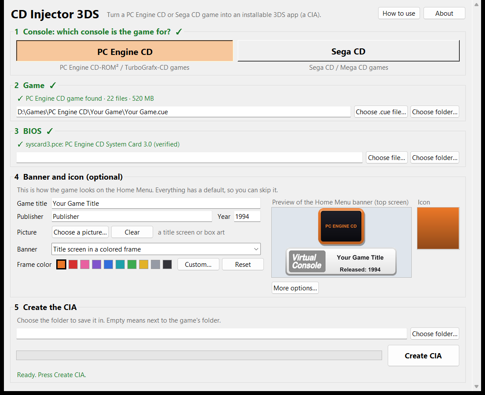

# CD Injector 3DS

[](https://github.com/Hahnter/CD-Injector-3DS/releases/latest)
[](https://github.com/Hahnter/CD-Injector-3DS/actions/workflows/ci.yml)
[-blue)](LICENSE)

Turn **PC Engine CD / TurboGrafx-CD** and **Sega CD / Mega CD** games into installable **3DS CIAs**. Each game
gets its own Home Menu icon and banner, and everything it needs is packed inside the CIA.



## Quick start

1. Download `CD-Injector-3DS-vX.Y.Z-windows.zip` from [Releases](https://github.com/Hahnter/CD-Injector-3DS/releases/latest),
   unzip it and run **CD Injector 3DS.exe**.
2. Pick the console, then your game's `.cue` file and the BIOS.
3. Press **Create CIA**.
4. Copy the `.cia` to your SD card and install it with FBI.

Nothing gets installed on your PC. The app is for Windows; on Linux or macOS you can run the command line version
from source (see [Building from source](#building-from-source)). The rest of this page explains each step and every
option.

## Features

- **Standalone emulators** (TemperPCE and PicoDrive from emus3ds), so RetroArch isn't needed. The CIAs run on the
  original 3DS and 2DS as well as the New models.
- **Self-contained.** The whole CD image (every track, CD audio included) and the BIOS go inside the CIA.
- **Boots straight into the game.** Saves go to `sdmc:/emus3ds/saves/<game>/`, including when you close the game
  from HOME.
- **A Home Menu banner and icon** made from your game's title screen, or taken from a banner you exported from NSUI.
  See [Your options](#your-options).

NSUI (New Super Ultimate Injector) makes CIAs for cartridge consoles but not for these two CD systems. This app
covers that gap.

**Status:** stable. Tested on real hardware with Sonic CD (Sega CD) and Castlevania: Rondo of Blood (PC Engine CD),
with both banner styles. See [Compatibility](#compatibility) and the [FAQ](#faq).

## What you need

- **The game** as a `.cue` file with its `.bin` files in the same folder (a backup of a disc you own). For a `.chd`
  file, convert it first with MAME's chdman: `chdman extractcd -i game.chd -o game.cue`
- **The console's BIOS file:**
  - PC Engine CD: **System Card 3.0**, named `syscard3.pce`
  - Sega CD: `bios_CD_U.bin` (USA), `bios_CD_E.bin` (Europe) or `bios_CD_J.bin` (Japan), matching the game's
    region
- **A 3DS with custom firmware** and **FBI** (or a similar tool) to install the CIA.

This app includes no games and no BIOS files.

## Step by step

The window has five numbered steps. Each shows a green check when it's done, and the line at the bottom always
says what to do next. The **How to use** button repeats all of this inside the app.

1. **Console.** Choose **PC Engine CD** or **Sega CD**. The rest of the window unlocks.
2. **Game.** Choose the `.cue` file, or the folder that holds it. The app checks the disc and warns you if it looks
   like a different console.
3. **BIOS.** Choose the BIOS file, or the folder it's in. If you leave this empty, the app searches next to the
   game.
4. **Banner and icon** *(optional)*. Everything has a default, so you can skip it. See
   [Your options](#your-options).
5. **Create the CIA.** Choose the folder to save it in (empty means next to the game's folder) and press
   **Create CIA**. It takes about a minute.

Then copy the `.cia` to your 3DS's SD card. On the 3DS, open **FBI**, choose **SD**, find the file and choose
**Install CIA**.

## Your options

All of these are in step 4. None of them are required.

| Option | What it does |
| --- | --- |
| Game title, Publisher, Year | Shown on the banner's plate and under the icon on the Home Menu. The title is filled in from the file name; change it if you like. Titles in any language work, Japanese included. |
| Picture | A title screen or box art. It becomes the picture on the banner and the icon. |
| Banner: *Title screen in a colored frame* | Makes the banner from your picture. Pick the frame color from the swatches, choose **Custom...** for any color, or **Reset** for the console's own (orange for PC Engine CD, blue for Sega CD). |
| Banner: *3D console + TV banner from NSUI* | Uses a banner and icon you exported from NSUI. See below. |
| More options... | How the picture fits the icon, your own banner sound, and the font used on the title plate. |

The preview in the window shows the banner and icon as they'll look. The frame follows the shape of your picture,
so nothing is cropped.

### A banner and icon from NSUI

NSUI can't make CIAs from Sega CD or PC Engine CD games, but it can for Genesis and TurboGrafx cartridge games, and
it gives those a 3D console, controller and TV banner. To put that banner on a CD game:

1. In NSUI, set up a Genesis or TurboGrafx game with the title screen you want, and export its **banner** and
   **icon** (`<game>_banner.bin`, `<game>_icon.bin`).
2. In this app, set **Banner** to *3D console + TV banner from NSUI* and choose the banner file. If the icon is next
   to it under NSUI's usual name, it's filled in for you. Switch **Banner** back any time to use the colored frame.

The banner is used exactly as NSUI made it: its 3D models (every language slot included), TV picture and sound are
copied byte for byte. There is one repair. Some NSUI exports (the PC Engine ones) leave the title plate blank, so
the app draws the plate with your title and year and rewrites only that part. A plate that's already filled in is
left alone. The preview shows the banner's 3D console, TV and plate as a still picture.

Nothing from NSUI is included in this app; it only reads the files you export. Because such a banner carries NSUI's
3D model, keep those CIAs to yourself (you shouldn't share any CIA you make anyway, see below).

### More options

- **Icon picture:** how your picture fits the square icon (fill top to bottom, or side to side). The other
  direction gets black bars.
- **Banner sound:** a `.wav` (8- or 16-bit PCM, at most 3 seconds) or a `.bcwav` that plays on the Home Menu. Empty
  means a short chime made by this program. An NSUI banner keeps its own sound.
- **Title plate font:** any `.ttf` or `.otf` file, used for the title and "Released" text on the plate. Official
  Virtual Console banners look closest with Sony's "SCE-PS3 Rodin Latin Bold". It can't be included here, but it
  works if you point the app at your own copy (an RPCS3 install has it at
  `dev_flash\data\font\SCE-PS3-RD-B-LATIN.TTF`). Empty means Arial Bold.

The NSUI banner and icon fields also accept an ordinary picture (PNG, JPG and so on) to use as the banner or icon as
it is.

## Good to know

- The CIA is about the size of the disc. FBI needs that much free space again while installing; you can delete the
  `.cia` afterwards. On the PC, the build needs about twice the disc's size free in your TEMP folder.
- Making the same game again with the same title keeps its title ID, so installing it again updates the earlier
  copy and keeps its saves. The app shows the title ID when it finishes.
- **A game freezes or glitches:** touch the bottom screen for the emulator menu and try the other **CPU Core**
  setting (PC Engine CD). The setting is remembered per game.
- **Never share a CIA you made.** It contains the game and the BIOS.

### Command line

```
python cd_injector.py build "Game folder" --system pce --bios Bios --title "Game Title" --year 1993 --image title.png --frame-color "#d63030"
python cd_injector.py build "Game folder" --system segacd --title "Game Title" --year 1993 --banner-file game_banner.bin --icon-file game_icon.bin
python cd_injector.py build --help
```

## Compatibility

The app packs any valid disc image; whether a game runs well is up to the emulator. These results were checked on
real hardware:

| Game | System | Result | Notes |
| --- | --- | --- | --- |
| Sonic CD (USA) | Sega CD | Runs | |
| Castlevania: Rondo of Blood (English patch v1.03) | PC Engine CD | Runs | Froze after the opening cutscene with TemperPCE's fast CPU core; runs with the compatible core, which is the default for CIAs from this app. |

Tried another game? Please open a
[compatibility report](https://github.com/Hahnter/CD-Injector-3DS/issues/new?template=compatibility_report.yml) with the result, even if it didn't work.

## FAQ

**Does it work on an original 3DS or 2DS?**
The emulators (from emus3ds) run on every 3DS and 2DS model. How smoothly a game runs depends on the game, and the
New models have more headroom. Please say which model you used in a compatibility report.

**How is this different from a RetroArch forwarder?**
There's nothing to set up on the SD card. The emulator, the game and the BIOS are all inside the one CIA, and it
boots straight into the game.

**Can I use a `.chd`, `.iso` or MP3/OGG version of the game?**
Convert a `.chd` to `.cue` + `.bin` first (see [What you need](#what-you-need)). A `.cue` with `.bin` tracks is
the format that has been tested.

**Where do my saves go?**
To `sdmc:/emus3ds/saves/<game>/` on the SD card, so they survive reinstalling the CIA or making it again.

**A game freezes or glitches. What can I try?**
Touch the bottom screen to open the emulator menu. For PC Engine CD games, switch the **CPU Core** setting; it's
remembered per game. If that doesn't help, please file a
[compatibility report](https://github.com/Hahnter/CD-Injector-3DS/issues/new?template=compatibility_report.yml).

**Windows or my antivirus warns about the app. Is it safe?**
The app isn't code-signed, so SmartScreen warns the first time (choose **More info**, then **Run anyway**).
Some antivirus programs also flag apps packaged with PyInstaller by mistake. Compare the download with
`SHA256SUMS.txt` from the release, and the full source is in this repository if you'd rather build it yourself.

**How do I remove a game I installed?**
In FBI, open **Titles**, pick the game and choose **Delete Title**. You can also use **System Settings > Data
Management** on the 3DS. Its saves stay on the SD card in the folder above.

**Can I share the CIAs I make?**
No. They contain the game and the BIOS.

## Privacy and security

- **No internet, no tracking.** The app never connects to the internet and collects nothing. It reads only the
  files you choose, and writes only the CIA, temporary files (removed when it finishes) and a small settings file
  (`%APPDATA%\CD Injector 3DS\settings.json`) with the paths and colors you picked.
- **Files are checked before use.** A damaged, oversized or booby-trapped `.cue`, banner, icon, picture or sound
  gives an error message instead of being used. Only files inside the game's own folder are packed into a CIA.
- **Checking a download.** Each release has a `SHA256SUMS.txt`; compare it with
  `Get-FileHash <the zip> -Algorithm SHA256`. The program isn't code-signed, so Windows SmartScreen may warn the
  first time you run it.
- **Reporting a problem.** See [SECURITY.md](SECURITY.md).

## How it works

Each CIA holds the patched emulator plus a RomFS containing:
- `game/<title>.cue` and its tracks
- the BIOS
- `boot.txt`, which points at the game

The patch (`patches/autoboot-forwarder.patch`, against R-YaTian's emus3ds) makes the emulator:
- boot that game directly
- load the BIOS from RomFS
- redirect saves, save states and settings to the SD card
- save on exit
- default to TemperPCE's compatible CPU core
- disable PicoDrive's blank RAM cartridge
- fall back to English when the Chinese font isn't installed
- avoid a crash on exit caused by unmounting RomFS while tracks are open

Names inside the CIA are kept to plain ASCII (the tested case on the 3DS): accents are dropped, and a title with no
Latin letters is stored as `Game <id>`. The name you typed still shows on the Home Menu.

## Building from source

1. **Emulators and tools** (Linux or WSL with devkitPro `3ds-dev` + `3ds-zlib`, `gettext`, `curl`, `unzip`,
   `g++-mingw-w64-x86-64`): `scripts/build_emulators.sh`. It builds the patched emulators from a pinned emus3ds
   commit, builds bannertool from a pinned commit, and downloads the official makerom release (checked against its
   SHA-256).
2. **Windows app** (Python 3.10+ in a virtual environment; `pip install -r requirements-build.txt` pins Pillow and
   PyInstaller): `powershell -File scripts\build_windows.ps1 -Python .venv\Scripts\python.exe`. It runs the checks
   and tests first, then writes the app folder, the zip, the emulator source archive and `SHA256SUMS.txt`.

Run the tests on their own with `python -m unittest discover -s tests -t .`. See
[CONTRIBUTING.md](CONTRIBUTING.md) before sending changes.

## Credits and licenses

**CD Injector 3DS's own code is MIT-licensed** (see [LICENSE](LICENSE)): use it, change it and share it freely,
with credit. The download also bundles other people's work, which keeps its own terms:

- **emus3ds** by bubble2k16, continued by R-YaTian
- **Temper** by Exophase
- **PicoDrive** by notaz, irixxxx and contributors
- **bannertool** by Steveice10 (MIT)
- **makerom** by 3DSGuy, applestash and Jakcron (MIT)

PicoDrive's license means the **download as a whole is free and non-commercial**, and every release includes the
complete emulator source. The MIT license covers this project's own code only and doesn't change those terms. See
[THIRD-PARTY-NOTICES.md](THIRD-PARTY-NOTICES.md) for the details.

Not affiliated with or endorsed by Nintendo, Sega, NEC or the NSUI authors.
